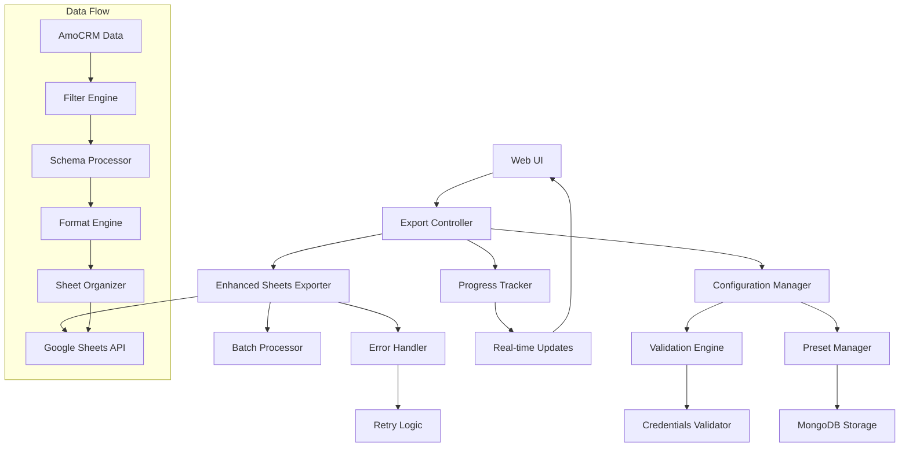

# Design Document

## Overview

This design document outlines the finalization of the AmoCRM → Google Sheets export pipeline. The system will build upon the existing `SheetsExporter` class and `ExportSettingsManager` to create a production-ready, robust Google Sheets export system with comprehensive configuration management, error handling, progress tracking, testing, and user experience enhancements.

The design focuses on extending the current architecture while maintaining compatibility with the existing FastAPI web interface, MongoDB storage, and worker system infrastructure.

## Architecture

### High-Level Architecture



### Component Interaction Flow

1. **Configuration Phase**: User configures export settings through web UI
2. **Validation Phase**: System validates Google Sheets configuration and credentials
3. **Processing Phase**: Data is filtered, formatted, and organized according to presets
4. **Export Phase**: Data is exported to Google Sheets with progress tracking and error handling
5. **Completion Phase**: User receives summary with direct links to exported sheets

## Components and Interfaces

### 1. Enhanced Configuration Manager

**Purpose**: Extends existing configuration system with Google Sheets specific validation and management.

**Interface**:
```python
class GoogleSheetsConfigManager:
    def validate_configuration(self) -> ConfigValidationResult
    def get_spreadsheet_info(self, spreadsheet_id: str) -> SpreadsheetInfo
    def test_permissions(self, spreadsheet_id: str) -> PermissionTestResult
    def setup_guided_configuration(self) -> ConfigurationWizard
```

**Key Features**:
- Validates all Google Sheets configuration parameters on startup
- Tests spreadsheet accessibility and permissions
- Provides clear error messages with setup instructions
- Integrates with existing `config.py` settings system

### 2. Export Schema Preset Manager

**Purpose**: Manages saved field configurations and export presets for each entity type.

**Interface**:
```python
class ExportPresetManager:
    def save_preset(self, entity_type: str, preset: ExportPreset) -> str
    def load_preset(self, preset_id: str) -> ExportPreset
    def list_presets(self, entity_type: str) -> List[ExportPreset]
    def delete_preset(self, preset_id: str) -> bool
    def duplicate_preset(self, preset_id: str, new_name: str) -> str
```

**Data Model**:
```python
@dataclass
class ExportPreset:
    name: str
    entity_type: str
    selected_fields: List[str]
    field_order: List[str]
    custom_field_mappings: Dict[str, str]  # field_id -> display_name
    filters: Dict[str, Any]
    created_at: datetime
    updated_at: datetime
```

### 3. Enhanced Sheets Exporter

**Purpose**: Extends existing `SheetsExporter` with improved error handling, batch processing, and progress tracking.

**Interface**:
```python
class EnhancedSheetsExporter(SheetsExporter):
    def export_with_progress(self, export_config: ExportConfiguration) -> ExportResult
    def export_with_presets(self, presets: Dict[str, ExportPreset]) -> ExportResult
    def validate_export_configuration(self, config: ExportConfiguration) -> ValidationResult
    def estimate_export_time(self, config: ExportConfiguration) -> TimeEstimate
```

**Key Enhancements**:
- Exponential backoff retry logic for API rate limits
- Configurable batch processing for large datasets
- Real-time progress tracking with WebSocket updates
- Comprehensive error logging and recovery mechanisms

### 4. Progress Tracking System

**Purpose**: Provides real-time progress updates during export operations.

**Interface**:
```python
class ExportProgressTracker:
    def start_export(self, export_id: str, total_entities: int) -> None
    def update_progress(self, export_id: str, entity_type: str, processed: int, total: int) -> None
    def complete_export(self, export_id: str, result: ExportResult) -> None
    def handle_error(self, export_id: str, error: ExportError) -> None
```

**Features**:
- WebSocket-based real-time updates to web UI
- Progress persistence for long-running operations
- Estimated completion time calculations
- Detailed error reporting with suggested actions

### 5. Data Filter and Organization Engine

**Purpose**: Handles date filtering, entity selection, and sheet organization according to requirements.

**Interface**:
```python
class DataFilterEngine:
    def apply_date_filter(self, deals: List[Dict], date_from: str, date_to: str) -> List[Dict]
    def filter_related_contacts(self, deals: List[Dict], all_contacts: List[Dict]) -> List[Dict]
    def organize_sheets(self, data: Dict[str, List[Dict]]) -> Dict[str, SheetData]
```

**Organization Rules**:
- Deals and contacts in separate sheets
- Companies, users, and pipelines in single combined reference sheet
- Events excluded from export operations
- Clear sheet naming with date ranges

## Data Models

### Export Configuration
```python
@dataclass
class ExportConfiguration:
    entity_presets: Dict[str, ExportPreset]  # entity_type -> preset
    date_filter: Optional[DateFilter]
    target_spreadsheets: Dict[str, str]  # entity_type -> spreadsheet_id
    batch_size: int = 1000
    retry_config: RetryConfiguration
    progress_callback: Optional[Callable] = None
```

### Date Filter
```python
@dataclass
class DateFilter:
    date_from: Optional[str]
    date_to: Optional[str]
    filter_field: str = "updated_at"  # Field to filter on
```

### Export Result
```python
@dataclass
class ExportResult:
    export_id: str
    status: ExportStatus
    exported_entities: Dict[str, int]  # entity_type -> count
    spreadsheet_urls: Dict[str, str]  # entity_type -> url
    errors: List[ExportError]
    duration: timedelta
    summary_stats: ExportSummary
```

### Sheet Organization
```python
@dataclass
class SheetData:
    sheet_name: str
    headers: List[str]
    rows: List[List[Any]]
    formatting_rules: List[FormattingRule]
```

## Error Handling

### Error Categories and Responses

1. **Configuration Errors**
   - Missing spreadsheet IDs → Clear setup instructions
   - Invalid credentials → OAuth renewal guidance
   - Permission issues → Specific permission requirements

2. **API Errors**
   - Rate limits → Exponential backoff with configurable delays
   - Network issues → Retry with circuit breaker pattern
   - Authentication failures → Token refresh and re-authentication

3. **Data Processing Errors**
   - Large dataset timeouts → Automatic batch size adjustment
   - Memory issues → Streaming processing implementation
   - Format errors → Graceful degradation with warnings

### Retry Strategy
```python
@dataclass
class RetryConfiguration:
    max_retries: int = 3
    base_delay: float = 1.0
    max_delay: float = 60.0
    exponential_base: float = 2.0
    jitter: bool = True
```

### Error Recovery Mechanisms
- Partial export recovery with resume capability
- Automatic fallback to smaller batch sizes
- Graceful degradation for formatting failures
- Detailed error logging for troubleshooting

## Testing Strategy

### Unit Testing
- **Configuration Manager**: Test validation logic, error messages, and setup flows
- **Preset Manager**: Test CRUD operations, data integrity, and edge cases
- **Sheets Exporter**: Test API interactions with mocked Google Sheets service
- **Progress Tracker**: Test real-time updates and state management
- **Filter Engine**: Test date filtering, entity relationships, and sheet organization

### Integration Testing
- **End-to-End Export Flow**: Test complete export process with test spreadsheets
- **Error Scenarios**: Test all failure modes and recovery mechanisms
- **Performance Testing**: Test with large datasets and concurrent operations
- **Configuration Validation**: Test with various invalid configurations

### Test Data Management
```python
class TestDataManager:
    def create_test_spreadsheet(self) -> str
    def populate_test_data(self, entity_counts: Dict[str, int]) -> None
    def cleanup_test_resources(self) -> None
    def generate_mock_amocrm_data(self, entity_type: str, count: int) -> List[Dict]
```

### Performance Benchmarks
- Export time for different dataset sizes
- Memory usage during large exports
- API rate limit handling effectiveness
- Concurrent export performance

## Implementation Phases

### Phase 1: Core Infrastructure
1. Enhanced configuration management with validation
2. Export preset system with MongoDB storage
3. Improved error handling and retry logic
4. Basic progress tracking implementation

### Phase 2: User Experience
1. Real-time progress updates via WebSocket
2. Comprehensive error messages and guidance
3. Export summary with direct links
4. Configuration validation tools

### Phase 3: Performance and Reliability
1. Optimized batch processing for large datasets
2. Memory-efficient streaming processing
3. Resumable export functionality
4. Advanced monitoring and diagnostics

### Phase 4: Testing and Documentation
1. Comprehensive test suite with mocked services
2. Performance benchmarking and optimization
3. User documentation and setup guides
4. Troubleshooting tools and diagnostics

## Security Considerations

### Credential Management
- Secure storage of OAuth tokens with encryption
- Automatic token refresh with fallback mechanisms
- Clear separation of test and production credentials
- Audit logging for credential access

### Data Privacy
- Minimal data exposure in error messages
- Secure handling of sensitive custom fields
- Proper cleanup of temporary data
- Compliance with data retention policies

### API Security
- Rate limiting compliance with Google Sheets API
- Proper error handling to avoid information leakage
- Secure communication channels (HTTPS only)
- Input validation and sanitization

## Performance Optimizations

### Batch Processing
- Dynamic batch size adjustment based on API response times
- Parallel processing for independent operations
- Memory-efficient data streaming for large datasets
- Intelligent retry scheduling to avoid cascading failures

### Caching Strategy
- Field metadata caching with TTL
- Spreadsheet information caching
- Configuration validation result caching
- Preview data caching for UI responsiveness

### Resource Management
- Connection pooling for Google Sheets API
- Memory usage monitoring and cleanup
- Graceful degradation under resource constraints
- Automatic scaling for concurrent exports

## Monitoring and Observability

### Metrics Collection
- Export success/failure rates
- Processing times by entity type and dataset size
- API rate limit utilization
- Error frequency and types

### Logging Strategy
- Structured logging with correlation IDs
- Different log levels for different audiences
- Performance metrics logging
- Error context preservation

### Health Checks
- Google Sheets API connectivity
- Configuration validity
- Credential status
- System resource availability

This design provides a comprehensive foundation for implementing the Google Sheets export finalization feature while maintaining compatibility with the existing system architecture and ensuring production-ready reliability and performance.